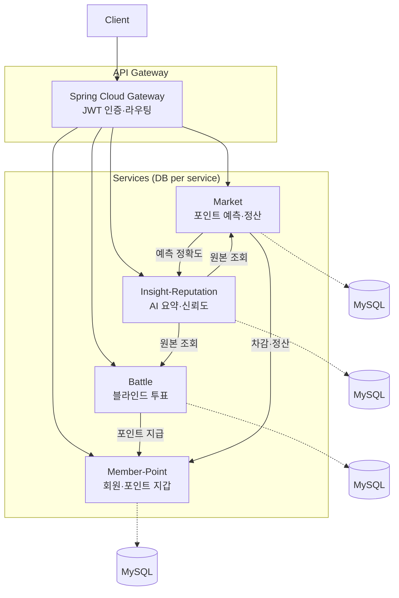

# 동네대전 🏘️

**지역 선택에 필요한 집단지성을 수집하는 플랫폼**

주관적 선호는 블라인드 투표(Battle)로, 객관적으로 판정 가능한 지역 지표는 포인트 예측 시장(Market)으로 운영하여, 사용자가 더 합리적인 지역 선택을 하도록 돕습니다.

> 프로젝트 · 4인 팀 · REST 기반 MSA
> 서비스 기획·정책 상세는 [docs/PLANNING.md](docs/PLANNING.md), 도메인별 스펙은 [docs/](docs/) 참고


## 핵심 기술 포인트

- **REST 기반 MSA** — API Gateway에서 JWT를 검증하고 인증 헤더를 전달, **서비스별 DB 분리**
- **포인트 정산 도메인** — 풀 배분 정산을 `BigDecimal`로 정밀 처리, **멱등성 키로 중복 지급 차단**
- **동시성 정합성** — 동시 예측 상황에서 옵션 가격 합·풀 총액 불변식 유지 (실험 검증)
- **트랜잭션 경계 최적화** — 외부 서비스 호출을 락 구간 밖으로 분리해 락 점유 시간 단축
- **실패 복구** — 정산/환불 재시도 스케줄러 + 불확실 거래 대사(reconciliation)

## Architecture



## Tech Stack

| 구분 | 기술 |
| --- | --- |
| Language | Java 17 |
| Framework | Spring Boot, Spring Cloud Gateway |
| Persistence | MyBatis, JPA, MySQL (서비스별 DB 분리) |
| 서비스 간 통신 | REST (Market: OpenFeign, Battle: RestTemplate) |
| Auth | JWT (Gateway 검증 후 `X-Member-Id` / `X-Member-Role` 전달) |
| Infra | Docker, docker-compose |

## 서비스 구성

| 서비스 | 책임 | 담당 |
| --- | --- | --- |
| API Gateway | 라우팅, JWT 검증, 인증 정보 전달 | 팀 |
| Member-Point | 회원, OAuth/JWT, 포인트 지갑·적립·차감·정산 | 팀 |
| Battle | 블라인드 투표, 댓글, 결과 통계 | 팀 |
| **Market** | **포인트 예측 참여, 가격 계산, 결과 확정, 정산·환불 처리** | **@asd1702** |
| Insight-Reputation | AI 요약, 사용자 신뢰도, 데이터 분석 | 팀 |

> Market Service 및 인프라(Docker) 담당자의 상세 기여: [docs/market/CONTRIBUTION.md](docs/market/CONTRIBUTION.md)

## Getting Started

**사전 준비:** Docker Desktop, JDK 17

```bash
# 1. 공용 MySQL 기동 (서비스별 스키마 자동 생성: market/memberpoint/battle/insight)
cd infra
docker compose up -d          # todongsan-mysql 컨테이너

# 2. 개별 서비스 실행 (예: Market — 8082)
cd ../market-service
cp .env.local.example .env.local     # 필요 시 값 조정
./gradlew bootRun
```

- 서비스별 컨테이너 실행은 각 `docker-compose.*-local.yml` / `*-rds.yml` 사용
- 통합 실행·환경 구성 상세: [infra/INFRA_GUIDE.md](infra/INFRA_GUIDE.md)

## Testing

Market Service는 정산 로직의 정합성을 통합 테스트로 검증합니다.

- 정산 계산·멱등성·환불·무효 처리 단위/통합 테스트
- 동시성 정합성, 트랜잭션 경계, 대사 복구 **실험 테스트**
- 실험 측정 결과: [EXPERIMENT_RESULTS.md](EXPERIMENT_RESULTS.md)

```bash
cd market-service
./gradlew test
```

## 설계 원칙 (요약)

- **Battle와 Market 분리** — 참여자가 결과를 직접 바꿀 수 있는 주제(선호 투표)에는 포인트 예측을 허용하지 않고, 외부 데이터로 판정 가능한 주제만 Market에서 운영
- **DB per service** — 서비스마다 독립 스키마로 결합도를 낮춤
- **포인트 정합성** — 포인트 관련 API는 멱등성 키로 중복 지급/차감 방지

자세한 정책(정산 방식, 어뷰징 방어, 엣지케이스 등)은 [docs/PLANNING.md](docs/PLANNING.md)에 정리되어 있습니다.

## Documentation

| 문서 | 내용 |
| --- | --- |
| [docs/PLANNING.md](docs/PLANNING.md) | 서비스 기획·정책 전문 |
| [docs/market/](docs/market/) | Market API·ERD·정산 실패 시나리오 |
| [docs/battle/](docs/battle/) | Battle API·ERD |
| [docs/member-point/](docs/member-point/) | Member-Point API·ERD |
| [docs/insight-reputation/](docs/insight-reputation/) | Insight-Reputation API·ERD |
