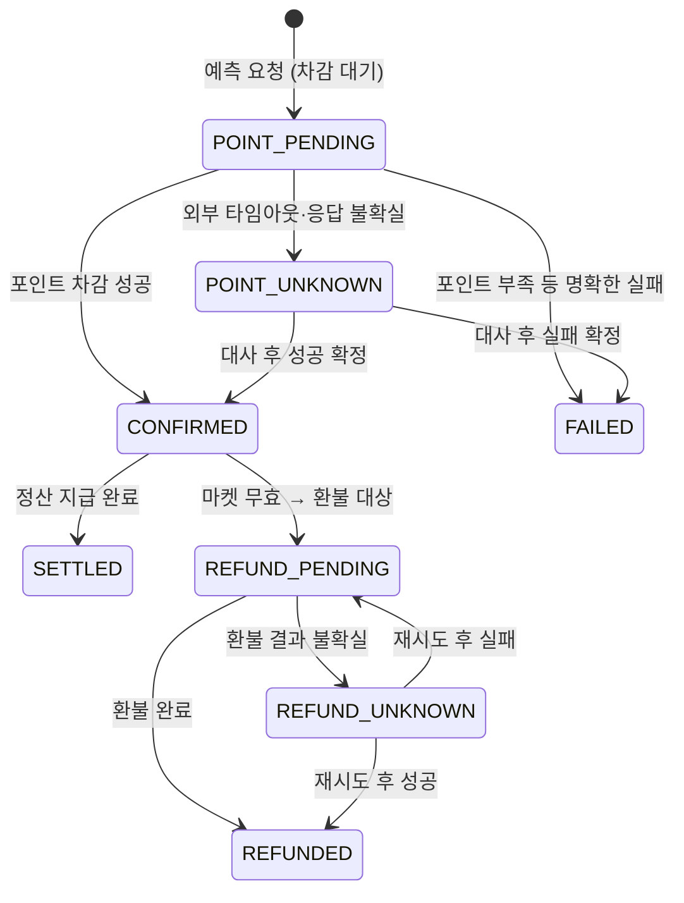
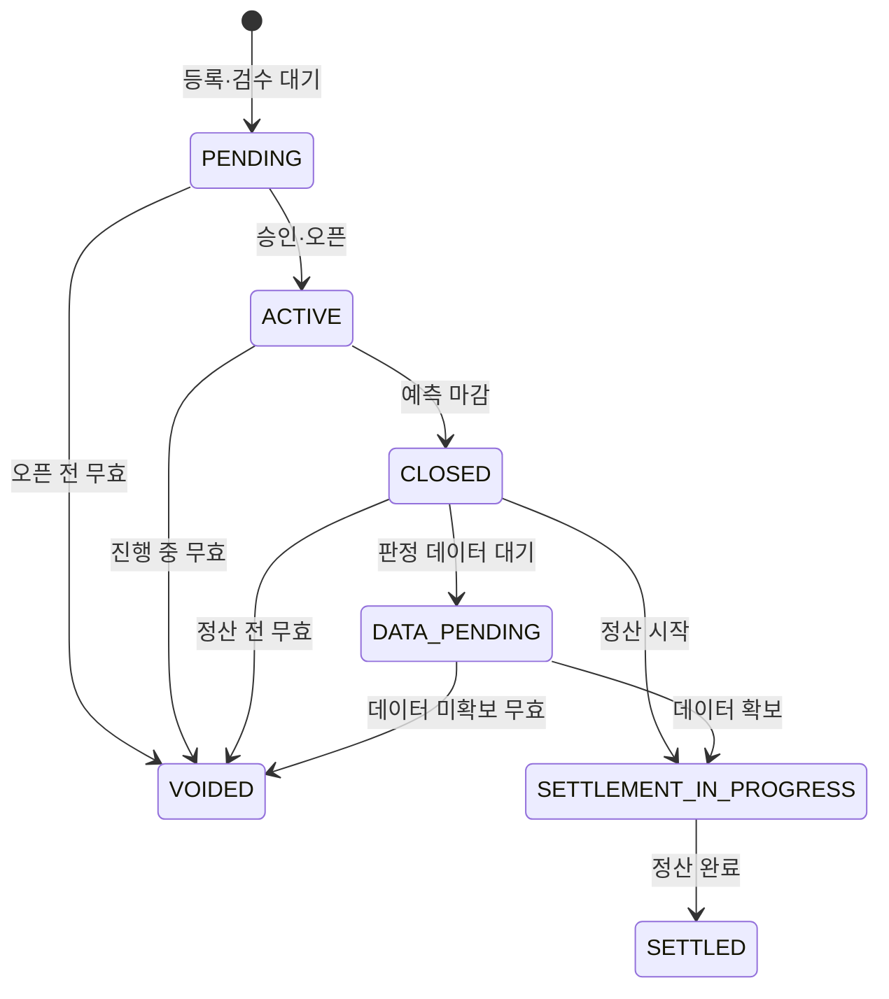
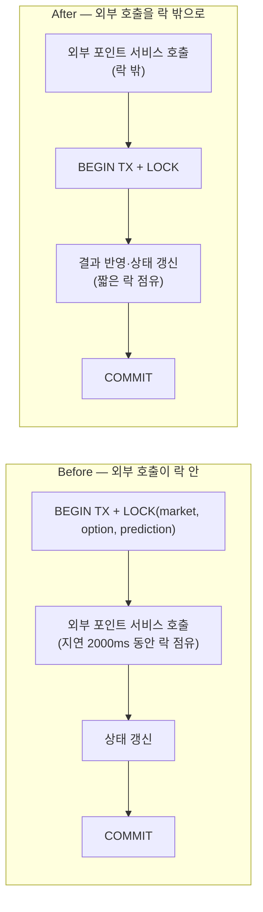

# Market Service — 담당자 기여 (@asd1702)

> 동네대전 4인 팀 프로젝트에서 **Market Service 전체**와 **인프라(Docker)**를 담당했습니다.
> Market은 사용자가 포인트를 사용해 예측에 참여하고, 결과 확정 후 정산·환불이 이어지는 **포인트 이동 도메인**입니다. 그래서 중복 차감·중복 지급·유실 없이 정합성을 지키는 것이 핵심 과제였습니다.

## 기여 요약

- Market Service의 예측 참여, 결과 확정, 정산, 무효·환불 흐름을 구현했습니다.
- 외부 Member-Point 서비스 실패와 타임아웃에 대비해 상태 기반 복구, 멱등성, 재시도 로직을 적용했습니다.
- 정산 계산에서 `BigDecimal`과 고정 소수점 정책을 적용해 소수점 오차와 초과 배분을 방지했습니다.
- 동시 예측 상황에서 풀/가격/정산 데이터 정합성을 검증하는 테스트와 실험을 작성했습니다.
- market-service Dockerfile과 docker-compose 실행 환경을 구성했습니다.

## 담당 범위

- **예측 참여** — 옵션 선택, 포인트 차감(외부 Member-Point 연동), 상태 기반 확정
- **정산** — 풀 배분 계산, 승자 지급, 멱등 처리
- **무효/환불** — 무효 사유 관리, 환불 대상 생성·지급
- **실패 복구** — 재시도 스케줄러, 불확실 거래 대사(reconciliation)
- **외부 연동** — Member-Point(차감/지급/환불), Insight-Reputation(예측 정확도) 클라이언트
- **인프라** — market-service Dockerize, docker-compose(local/rds), MySQL 스키마

---

## 1. 도메인 상태 흐름

### 예측(Prediction) 상태

포인트 차감은 외부 서비스 호출이라 "성공/실패"만으로는 부족합니다. **타임아웃·응답 불확실**을 별도 상태(`POINT_UNKNOWN`)로 분리해, 나중에 대사로 보정하도록 설계했습니다.

> **정산 대상은 `CONFIRMED` 예측만 포함**합니다. 차감이 확정되지 않은 참여가 정산에 섞이지 않도록 하는 것이 정합성의 출발점입니다.
> 위 다이어그램은 대표 상태 흐름을 요약한 것이며, 상태별 허용 전이와 예외 조건은 Market API Spec과 실제 서비스 코드를 기준으로 합니다.

### 마켓(Market) 상태

> 위 다이어그램은 대표 상태 흐름을 요약한 것이며, 상태별 허용 전이와 예외 조건은 Market API Spec과 실제 서비스 코드를 기준으로 합니다.

---

## 2. 핵심 구현

### 2-1. 정산 배분 계산의 정밀도
풀 배분 정산은 포인트가 사용자별로 이동하는 핵심 로직이므로, 소수점 오차와 초과 배분을 방지하는 것이 중요했습니다. 모든 금액을 `BigDecimal`로 다루고 `RoundingMode.DOWN`(버림) + 고정 소수 자릿수(금액 2자리, 수량 8자리)로 계산해, 부동소수 오차와 **배분 총합이 원본 풀을 초과하는 것**을 방지했습니다. 패자 풀에서 수수료를 차감한 뒤 옵션 계약수량 비율로 배분합니다.
> `MarketPredictionPayoutEstimateCalculator`

### 2-2. 중복 지급 차단 — 멱등성
포인트 차감·정산·환불은 외부 Member-Point 서비스 호출이므로 재시도가 발생할 수 있습니다. 이를 위해 요청 단위 `Idempotency-Key`와 항목별 멱등성 키를 사용해, 동일 요청이 반복되어도 중복 차감·중복 지급·중복 환불이 발생하지 않도록 했습니다.

- 예측 참여 요청: `MARKET_PREDICTION_SPEND:market:{marketId}:member:{memberId}`
- 예측 차감 내부 키: `MARKET_PREDICTION_SPEND:market:{marketId}:member:{memberId}:attempt:{attemptNo}`
- 정산 batch 추적 키: `MARKET_SETTLEMENT_BATCH:market:{marketId}:settlement:{settlementId}:attempt:{attemptNo}`
- 정산 item 키: `MARKET_SETTLEMENT_REWARD:market:{marketId}:prediction:{predictionId}:member:{memberId}`
- 환불 item 키: `MARKET_REFUND:market:{marketId}:prediction:{predictionId}:member:{memberId}`

현재 구현 기준으로 Member-Point 기록의 `referenceType`은 `MARKET_PREDICTION`, `referenceId`는 `predictionId`를 사용합니다. 상세 형식은 [Market API Spec](MARKET_API_SPEC.md)을 기준으로 합니다.

### 2-3. 트랜잭션 경계 최적화
예측 확정은 DB 행 잠금 구간과 외부 포인트 서비스 호출이 함께 일어납니다. 외부 호출을 **잠금 트랜잭션 안**에 두면, 외부 지연 동안 같은 마켓의 다른 예측이 전부 막힙니다.

외부 호출을 락 밖으로 분리해 **락 점유 시간을 2018ms → 53ms(약 97%)로 단축**했습니다. (실험④)

### 2-4. 실패 복구 — 재시도 & 대사(reconciliation)
- **재시도 스케줄러** — 정산/환불 지급 실패 건을 주기적으로 재시도 (`MarketSettlementRetryScheduler`, `MarketRefundRetryScheduler`)
- **대사** — 외부 호출 결과가 불확실한(`POINT_UNKNOWN` 등) 거래를 재조회해 `CONFIRMED`/`FAILED`로 확정 (`PredictionSpendReconciliationService`). 거래가 어중간한 상태로 고착되지 않게 함.

---

## 3. 검증 실험

실제 MySQL 환경에서 정합성·성능을 측정했습니다. (원문: [EXPERIMENT_RESULTS.md](../../EXPERIMENT_RESULTS.md))

| 실험 | 핵심 결과 |
| --- | --- |
| ① 동시성 정합성 | 동시 예측 50건 전부 CONFIRMED, 옵션 가격 합 = 1.0, 풀 5000.00 정확, lost update 0 |
| ② 정산 멱등성 | 1차 실패분 재시도 후 전건 SETTLED, **중복 지급 0** |
| ③ 대사 복구 | UNKNOWN 거래 분류 정확도 4/4, 고착 0 |
| ④ 트랜잭션 경계 A/B | 외부 지연 2000ms 시 락 점유 **2018ms → 53ms (97% 단축)** |

관련 테스트: `MarketSettlementServiceTest`, `MarketSettlementIdempotencyExperimentTest`, `MarketPredictionConcurrencyConsistencyTest`, `MarketTransactionBoundaryExperimentTest`, `PredictionSpendReconciliationExperimentTest` 등

---

## 4. 인프라

- market-service `Dockerfile` 작성, `docker-compose.market-local.yml` / `-rds.yml` 구성
- 서비스별 MySQL 스키마 분리(DB per service), 공용 네트워크 구성
- 프로필 분리(`application-local.yml` / `-prod.yml`), 스케줄러 on/off 환경변수화

## 5. 사용 기술
Java 17 · Spring Boot · MyBatis · MySQL · OpenFeign · Docker · docker-compose · JUnit 5

---
