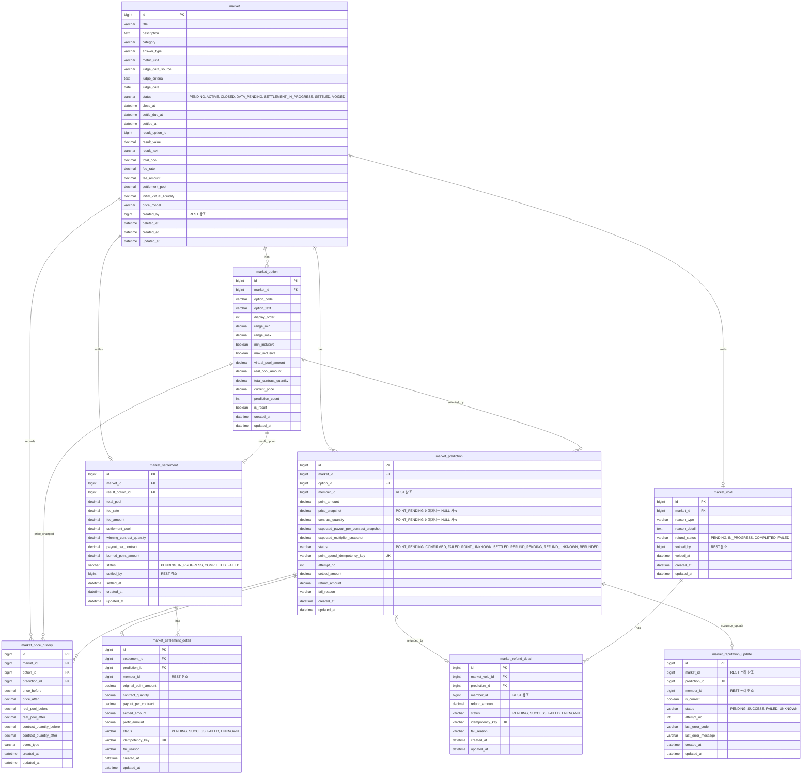

# MARKET_ERD_v4.md

> Market Service 데이터베이스 설계 문서 v4.
> 본 버전은 Pool Share 기반 즉시 참여형 예측시장 정책과 Quote API 계산 필드 정책을 반영한다.
>
> - 예측 참여는 `POINT_PENDING` 선저장 후 Member-Point API 호출, 이후 가격 확정 트랜잭션으로 분리한다.
> - 가격 확정 트랜잭션은 Market row와 해당 Market의 모든 MarketOption row를 비관적 락으로 잡는다.
> - Market DB에는 `reference_type`, `reference_id`를 중복 저장하지 않는다.
> - Member-Point 호출 시 애플리케이션 코드에서 `referenceType=MARKET_PREDICTION`, `referenceId=predictionId`를 만들어 보낸다.
> - 정산/환불 멱등성은 batch가 아니라 detail item 단위로 보장한다.
> - Insight-Reputation 조회용 데이터는 별도 테이블을 추가하지 않고 기존 Market 원본 테이블을 조회하여 제공한다.
> - 정산 완료 후 prediction accuracy update 전송 상태는 `market_reputation_update` outbox 테이블에서 관리한다.
> - 본 버전은 기존 테이블 구조를 유지하면서 Pool Share 기반 즉시 참여형 예측시장 정책을 명확히 한다.
> - Quote API는 별도 테이블을 추가하지 않고 기존 `market`, `market_option` 데이터로 계산한다.
> - `initialPrice`, `priceChangeRate`, 예상 계약 수량, 예상 참여 후 가격은 저장 컬럼이 아니라 조회/계산 필드다.
> - `virtual_pool_amount`는 초기 가격과 시장 깊이를 함께 결정한다.

---

# 1. 설계 방향

Market Service는 사용자가 Point를 사용해 객관적으로 판정 가능한 지역 이벤트를 예측하는 도메인이다.

Market은 YES/NO뿐 아니라 다중 선택지와 수치 구간형 선택지를 지원한다.

```text
YES_NO          : 상승 / 하락, YES / NO
MULTIPLE_CHOICE : 여러 개의 일반 선택지
NUMERIC_RANGE   : 수치 구간 기반 선택지
```

Market은 Battle과 달리 사용자의 투표 결과로 승패가 결정되지 않는다.  
결과는 공공데이터, 외부 지표, 관리자 검수 기준에 의해 확정된다.

---


## 1-1. Pool Share 기반 즉시 참여형 예측시장 모델

Market Service는 Polymarket식 주문장 기반 CLOB 모델이 아니라, 선택지별 유동성 풀을 기반으로 가격이 자동 조정되는 **Pool Share 기반 즉시 참여형 예측시장** 모델을 사용한다.

```text
optionEffectivePoolAmount = market_option.virtual_pool_amount + market_option.real_pool_amount
totalEffectivePoolAmount = sum(all optionEffectivePoolAmount)
currentPrice = optionEffectivePoolAmount / totalEffectivePoolAmount
```

이 모델에서 사용자는 지정가 주문을 올리지 않는다.
사용자는 현재 Pool Share 가격 기준으로 즉시 예측에 참여하며, 참여가 확정되면 선택한 option의 `real_pool_amount`가 증가한다.
이후 모든 option의 `current_price`가 전체 effective pool 기준으로 재계산되고, 확정 결과는 `market_prediction`과 `market_price_history`에 기록된다.

현재 MVP에는 `order`, `trade`, `position`, `bid`, `ask`, `order cancel`, `matching engine`, `limit order` 개념을 두지 않는다.

pool 용어는 다음 기준으로 구분한다.

| 용어 | 의미 |
|---|---|
| `realPoolAmount` | 실제 사용자가 예측 참여에 사용한 포인트 누적합 |
| `virtualPoolAmount` | Market 생성 시 선택지별로 부여하는 가상 유동성 |
| `effectivePoolAmount` | `realPoolAmount + virtualPoolAmount` |
| `totalRealPoolAmount` | 모든 option의 `realPoolAmount` 합 |
| `totalVirtualPoolAmount` | 모든 option의 `virtualPoolAmount` 합 |
| `totalEffectivePoolAmount` | `totalRealPoolAmount + totalVirtualPoolAmount` |

`market.total_pool`은 실제 참여 포인트 총합이며, 가격 계산용 전체 pool이 아니다.

```text
market.total_pool = sum(all market_option.real_pool_amount)
```

`virtual_pool_amount`는 다음 두 가지 역할을 가진다.

```text
1. 초기 사전 확률 반영
2. 초기 시장 깊이 제공
```

예시:

```text
A option virtual_pool_amount = 800
B option virtual_pool_amount = 200

A initialPrice = 0.80000000
B initialPrice = 0.20000000
```

따라서 Market은 항상 50:50으로 시작하지 않는다.
정배/역배가 명확한 Market은 선택지별 `virtual_pool_amount` 비율을 다르게 설정할 수 있다.

단, 결과가 이미 사실상 확정된 주제는 예측시장으로서 의미가 낮으므로 관리자 검수 단계에서 개설하지 않는 것을 원칙으로 한다.

## 1-2. Quote API 데이터 저장 정책

Quote API는 별도 테이블을 사용하지 않는다.

Quote API는 다음 테이블을 읽어서 예상 결과만 계산한다.

| 계산 항목 | 사용 데이터 |
|---|---|
| 현재 가격 | `market_option.current_price` |
| 예상 계약 수량 | 요청 `pointAmount`, `current_price` |
| 선택지 effective pool | `market_option.virtual_pool_amount`, `market_option.real_pool_amount` |
| 전체 effective pool | 해당 Market의 모든 option `virtual_pool_amount + real_pool_amount` |
| 참여 후 예상 가격 | 선택 option effective pool, 전체 effective pool, 요청 `pointAmount` |
| 가격 영향도 | 현재 가격, 참여 후 예상 가격 |

Quote API는 다음 데이터를 저장하지 않는다.

```text
market_prediction
market_price_history
market_settlement
market_refund_detail
```

Quote API는 `market`, `market_option`을 일반 SELECT로 조회한다.
상태 변경이 없는 미리보기 API이므로 `SELECT ... FOR UPDATE`를 사용하지 않는다.
Quote API는 `market_price_history`를 읽거나 쓰지 않으므로 PriceHistory v4 schema/migration 작업과 독립적으로 구현할 수 있다.
PriceHistory v4 저장 정책이 확정되지 않아도 Quote API 계산 필드에는 영향을 주지 않는다.

즉, Quote는 확정 견적이 아니라 미리보기 계산이며, 실제 예측 참여 결과는 가격 확정 트랜잭션에서 최신 Pool 상태를 기준으로 확정한다.
실제 예측 참여 API에서만 Market row와 모든 option row를 `FOR UPDATE`로 잠근다.

## 1-3. 조회 전용 계산 필드

다음 값은 DB 컬럼으로 추가하지 않는다.
API 응답 시 기존 컬럼을 조합해 계산한다.

| 응답 필드 | 계산 기준 |
|---|---|
| `initialPrice` | option.virtualPoolAmount / sum(all option.virtualPoolAmount) |
| `priceChangeRate` | (currentPrice - initialPrice) / initialPrice * 100 |
| `effectivePoolAmount` | option.realPoolAmount + option.virtualPoolAmount |
| `totalRealPoolAmount` | sum(all option.realPoolAmount). `market.total_pool`과 같은 의미 |
| `totalVirtualPoolAmount` | sum(all option.virtualPoolAmount) |
| `totalEffectivePoolAmount` | totalRealPoolAmount + totalVirtualPoolAmount |
| `estimatedContractQuantity` | pointAmount / currentPrice |
| `estimatedAfterPrice` | selected option effective pool after / total effective pool after |
| `priceImpactRate` | (estimatedAfterPrice - currentPrice) / currentPrice * 100 |
| `selectedOptionEffectivePoolBefore` | selected option realPoolAmount + virtualPoolAmount |
| `selectedOptionEffectivePoolAfter` | selectedOptionEffectivePoolBefore + pointAmount |
| `totalEffectivePoolBefore` | sum(all option realPoolAmount + virtualPoolAmount) |
| `totalEffectivePoolAfter` | totalEffectivePoolBefore + pointAmount |

이 값들은 화면 표시와 사용자 의사결정을 위한 계산 필드다. 정산 재원은 `market_prediction.point_amount`, reward 분배 가중치는 정답 선택지의 `market_prediction.contract_quantity`를 기준으로 한다. `market_option.current_price`, `virtual_pool_amount`, `market_price_history`는 정산 재원이 아니다.
Quote 응답 필드의 scale과 RoundingMode는 `MARKET_API_SPEC.md`의 Quote API 정책을 따른다.
Quote 계산 결과는 저장 컬럼이 아니다.

---

# 2. 서비스 간 참조 원칙

Market Service는 독립 DB를 가진다.

다른 서비스의 테이블을 직접 FK로 참조하지 않는다.  
다른 서비스 데이터가 필요한 경우 REST API를 통해 조회한다.

| 컬럼 | 의미 | 참조 방식 |
|---|---|---|
| `created_by` | Market 생성자 | Member-Point REST 조회 |
| `member_id` | 예측 참여자 | Member-Point REST 조회 |
| `settled_by` | 정산 관리자 | Member-Point REST 조회 |
| `voided_by` | 무효 처리 관리자 | Member-Point REST 조회 |

---

# 3. Member-Point referenceType 연동 기준

Market이 Member-Point API를 호출할 때는 다음 값을 전달한다.

```text
referenceType = MARKET_PREDICTION
referenceId = predictionId
```

이 값은 Member-Point의 `point_history`에 기록된다.

Market DB에는 이미 `prediction_id`가 있으므로 `reference_type`, `reference_id` 컬럼을 별도로 저장하지 않는다.

| Market 상황 | Member-Point type | referenceType | referenceId |
|---|---|---|---|
| 예측 참여 차감 | `SPEND_MARKET` | `MARKET_PREDICTION` | predictionId |
| 정산 보상 지급 | `SETTLE_MARKET` | `MARKET_PREDICTION` | predictionId |
| 무효 환불 | `REFUND_MARKET` | `MARKET_PREDICTION` | predictionId |

---

# 4. 동시성 제어 정책

Pool-Share 가격 계산은 전체 선택지 pool 합에 의존한다.

```text
선택지 가격 = 해당 선택지 pool / 전체 선택지 pool 합
```

따라서 선택한 option row만 락 잡는 방식은 사용하지 않는다.

가격 확정 트랜잭션에서는 다음 순서로 락을 잡는다.

```sql
SELECT *
FROM market
WHERE id = :marketId
FOR UPDATE;
```

```sql
SELECT *
FROM market_option
WHERE market_id = :marketId
ORDER BY id
FOR UPDATE;
```

처리 기준:

```text
1. 한 Market 안의 예측 참여 확정은 순차 처리한다.
2. Market row를 먼저 락 잡는다.
3. 해당 Market의 모든 MarketOption row를 optionId 오름차순으로 락 잡는다.
4. 고정 순서로 락을 잡아 데드락 가능성을 줄인다.
5. DB 락을 잡은 트랜잭션 안에서 외부 HTTP API를 호출하지 않는다.
```

---

# 5. 테이블 목록

| 테이블 | 설명 |
|---|---|
| `market` | Market 주제, 판정 기준, 상태, 전체 풀 정보 |
| `market_option` | 선택지, 수치 구간, 현재 가격, 선택지별 풀 정보 |
| `market_prediction` | 사용자별 예측 참여 기록 |
| `market_price_history` | 선택지 가격 변동 이력. 가격 그래프의 원천 데이터 |
| `market_settlement` | Market 단위 정산 결과 |
| `market_settlement_detail` | 사용자별 정산 지급 상세 |
| `market_void` | Market 무효 처리 기록 |
| `market_refund_detail` | 무효 처리 시 사용자별 환불 상세 |
| `market_reputation_update` | 정산 완료 후 Insight-Reputation Service로 prediction accuracy update를 전송하기 위한 outbox task |

---

# 6. 테이블 상세 DDL

## 6-1. market

```sql
CREATE TABLE market (
    id                          BIGINT          NOT NULL AUTO_INCREMENT,

    title                       VARCHAR(255)    NOT NULL,
    description                 TEXT,

    category                    VARCHAR(50)     NOT NULL,
    -- PRICE_INDEX, TRANSACTION_VOLUME, ACTUAL_PRICE, POLICY_EVENT

    answer_type                 VARCHAR(30)     NOT NULL,
    -- YES_NO, MULTIPLE_CHOICE, NUMERIC_RANGE

    metric_unit                 VARCHAR(30),
    -- PERCENT, COUNT, KRW, INDEX_POINT 등

    judge_data_source           VARCHAR(255)    NOT NULL,
    judge_criteria              TEXT            NOT NULL,
    judge_date                  DATE            NOT NULL,

    status                      VARCHAR(30)     NOT NULL DEFAULT 'PENDING',
    -- PENDING, ACTIVE, CLOSED, DATA_PENDING, SETTLEMENT_IN_PROGRESS, SETTLED, VOIDED

    close_at                    DATETIME        NOT NULL,
    settle_due_at               DATETIME,
    settled_at                  DATETIME,

    result_option_id            BIGINT,
    -- 확정된 승리 선택지. market_option.id 논리 참조
    -- 순환 FK 방지를 위해 DDL에서는 FK를 직접 걸지 않는다.

    result_value                DECIMAL(12,4),
    result_text                 VARCHAR(255),

    total_pool                  DECIMAL(10,2)   NOT NULL DEFAULT 0.00,
    -- 실제 참여 포인트 총합. sum(all market_option.real_pool_amount)
    -- virtual_pool_amount는 포함하지 않는다.
    fee_rate                    DECIMAL(5,2)    NOT NULL DEFAULT 5.00,
    fee_amount                  DECIMAL(10,2)   NOT NULL DEFAULT 0.00,
    -- 정산 완료 시 losingPool 기준 수수료
    -- floor2(losingPool * feeRate / 100)
    -- total_pool 전체 기준 수수료가 아니다.
    settlement_pool             DECIMAL(10,2)   NOT NULL DEFAULT 0.00,
    -- 정산 지급 가능 풀: winningPrincipalPool + rewardPool
    -- rewardPool = losingPool - feeAmount
    -- virtual_pool_amount는 포함하지 않는다.

    initial_virtual_liquidity   DECIMAL(10,2)   NOT NULL DEFAULT 100.00,
    price_model                 VARCHAR(30)     NOT NULL DEFAULT 'POOL_SHARE',

    created_by                  BIGINT          NOT NULL,
    -- Member-Point Service의 member.id 외부 참조

    deleted_at                  DATETIME,
    created_at                  DATETIME        NOT NULL,
    updated_at                  DATETIME        NOT NULL,

    PRIMARY KEY (id),

    INDEX idx_market_status (status),
    INDEX idx_market_close_at (close_at),
    INDEX idx_market_judge_date (judge_date),
    INDEX idx_market_status_close_at (status, close_at)
);
```

---

## 6-2. market_option

```sql
CREATE TABLE market_option (
    id                          BIGINT          NOT NULL AUTO_INCREMENT,

    market_id                   BIGINT          NOT NULL,

    option_code                 VARCHAR(20)     NOT NULL,
    option_text                 VARCHAR(100)    NOT NULL,
    display_order               INT             NOT NULL DEFAULT 0,

    range_min                   DECIMAL(12,4),
    range_max                   DECIMAL(12,4),
    min_inclusive               BOOLEAN         NOT NULL DEFAULT TRUE,
    max_inclusive               BOOLEAN         NOT NULL DEFAULT FALSE,

    virtual_pool_amount         DECIMAL(10,2)   NOT NULL DEFAULT 100.00,
    real_pool_amount            DECIMAL(10,2)   NOT NULL DEFAULT 0.00,
    total_contract_quantity     DECIMAL(24,8)   NOT NULL DEFAULT 0.00000000,

    current_price               DECIMAL(18,8)   NOT NULL DEFAULT 0.00000000,
    prediction_count            INT             NOT NULL DEFAULT 0,

    is_result                   BOOLEAN         NOT NULL DEFAULT FALSE,

    created_at                  DATETIME        NOT NULL,
    updated_at                  DATETIME        NOT NULL,

    PRIMARY KEY (id),

    UNIQUE KEY uq_market_option_code (market_id, option_code),
    INDEX idx_market_option_market_id (market_id),
    INDEX idx_market_option_market_order (market_id, display_order),

    CONSTRAINT fk_market_option_market
        FOREIGN KEY (market_id)
        REFERENCES market(id)
);
```

---

## 6-3. market_prediction

사용자의 예측 참여 기록을 저장한다.

`POINT_PENDING` 상태로 먼저 생성된 뒤, Member-Point 포인트 차감 성공 후 가격 확정 트랜잭션에서 `price_snapshot`, `contract_quantity`가 확정된다.
명확한 실패(`FAILED`) 후 재시도할 때는 같은 row를 재사용하고 `attempt_no`를 증가시킨다.

```sql
CREATE TABLE market_prediction (
    id                                      BIGINT          NOT NULL AUTO_INCREMENT,

    market_id                               BIGINT          NOT NULL,
    option_id                               BIGINT          NOT NULL,

    member_id                               BIGINT          NOT NULL,
    -- Member-Point Service의 member.id 외부 참조

    point_amount                            DECIMAL(10,2)   NOT NULL,
    -- 사용자가 실제로 사용한 Point. 최소 10P, 최대 500P

    price_snapshot                          DECIMAL(18,8),
    -- 예측 확정 시점의 1계약당 가격
    -- POINT_PENDING / POINT_UNKNOWN 상태에서는 NULL 가능

    contract_quantity                       DECIMAL(24,8),
    -- point_amount / price_snapshot
    -- 고정 지급권이 아니라 정답 선택지 내 rewardPool 분배 가중치
    -- 오답 선택지의 계약 수량은 만기 시 가치 0
    -- POINT_PENDING / POINT_UNKNOWN 상태에서는 NULL 가능

    expected_payout_per_contract_snapshot   DECIMAL(18,8),
    expected_multiplier_snapshot            DECIMAL(18,8),

    status                                  VARCHAR(30)     NOT NULL DEFAULT 'POINT_PENDING',
    -- POINT_PENDING, CONFIRMED, FAILED, POINT_UNKNOWN, SETTLED, REFUND_PENDING, REFUND_UNKNOWN, REFUNDED

    point_spend_idempotency_key             VARCHAR(150)    NOT NULL UNIQUE,
    -- Member-Point SPEND_MARKET 차감 요청 멱등성 키
    -- MARKET_PREDICTION_SPEND:market:{marketId}:member:{memberId}:attempt:{attemptNo}

    attempt_no                              INT             NOT NULL DEFAULT 1,
    -- FAILED 재시도 횟수 식별값. 최초 요청은 1

    settled_amount                          DECIMAL(10,2),
    refund_amount                           DECIMAL(10,2),

    fail_reason                             VARCHAR(255),

    created_at                              DATETIME        NOT NULL,
    updated_at                              DATETIME        NOT NULL,

    PRIMARY KEY (id),

    UNIQUE KEY uq_market_prediction_member (market_id, member_id),
    INDEX idx_market_prediction_market_status (market_id, status),
    INDEX idx_market_prediction_market_option (market_id, option_id),
    INDEX idx_market_prediction_market_created (market_id, created_at),
    INDEX idx_market_prediction_member_id (member_id),
    INDEX idx_market_prediction_option_status (option_id, status),
    INDEX idx_market_prediction_point_spend_key (point_spend_idempotency_key),

    CONSTRAINT fk_market_prediction_market
        FOREIGN KEY (market_id)
        REFERENCES market(id),

    CONSTRAINT fk_market_prediction_option
        FOREIGN KEY (option_id)
        REFERENCES market_option(id),

    CONSTRAINT chk_market_prediction_point_amount
        CHECK (point_amount >= 10 AND point_amount <= 500)
);
```

> `price_snapshot`, `contract_quantity`는 `POINT_PENDING` 선저장 구조 때문에 NULL을 허용한다.  
> `CONFIRMED`, `SETTLED`, `REFUNDED` 등 확정 이후 상태에서는 애플리케이션 로직에서 NOT NULL을 보장한다.

---

## 6-4. market_price_history

`market_price_history`는 프론트엔드의 선택지별 가격 그래프를 위한 원천 데이터다.

저장 단위:

```text
market_price_history row 1건 = 특정 Market의 특정 option에 대한 특정 가격 변경 이벤트 1건
```

Pool Share에서는 한 사용자가 특정 option에 참여해도 전체 effective pool이 변하므로 모든 option의 `current_price`가 재계산된다.
따라서 Prediction CONFIRMED 시 해당 Market의 모든 option에 대해 `market_price_history` row를 생성한다.

선택된 option:

```text
realPoolBefore != realPoolAfter
contractQuantityBefore != contractQuantityAfter
priceBefore != priceAfter 가능
```

선택되지 않은 option:

```text
realPoolBefore = realPoolAfter
contractQuantityBefore = contractQuantityAfter
priceBefore != priceAfter 가능
```

선택되지 않은 option도 가격이 변할 수 있으므로 history를 저장한다.
선택 option만 저장하면 선택되지 않은 option의 가격 그래프가 끊기거나 부정확해진다.

MVP v4의 `event_type`은 우선 `PREDICTION_CONFIRMED`만 사용한다.
Quote, Market 생성/활성화, 결과 확정, 정산, 환불, 무효 처리는 PriceHistory를 생성하지 않는다.

초기 가격은 별도 history row가 아니라 Market 상세 조회의 `initialPrice`로 제공한다.
추후 그래프 시작점을 PriceHistory에 포함해야 한다면 `MARKET_ACTIVATED` eventType을 추가할 수 있지만, MVP v4에서는 추가하지 않는다.

`virtual_pool_amount`는 Market 생성 후 변경하지 않는다. 따라서 가격 이력 테이블에 별도 snapshot을 저장하지 않고, 가격 이력 조회 시 `market_option`과 JOIN하여 응답한다.
`priceChangeRate`도 저장하지 않고 `price_before`, `price_after`로 계산한다.
`total_effective_pool_before`, `total_effective_pool_after`는 MVP v4에서 저장하지 않는다.
조회 성능 또는 프론트 요구가 커지면 후속 v5에서 totalEffectivePool snapshot 컬럼을 추가할 수 있다.

```sql
CREATE TABLE market_price_history (
    id                          BIGINT          NOT NULL AUTO_INCREMENT,

    market_id                   BIGINT          NOT NULL,
    option_id                   BIGINT          NOT NULL,
    prediction_id               BIGINT          NOT NULL,

    event_type                  VARCHAR(30)     NOT NULL,
    -- PREDICTION_CONFIRMED

    price_before                DECIMAL(18,8)   NOT NULL,
    price_after                 DECIMAL(18,8)   NOT NULL,

    real_pool_before            DECIMAL(18,2)   NOT NULL,
    real_pool_after             DECIMAL(18,2)   NOT NULL,

    contract_quantity_before    DECIMAL(18,8)   NOT NULL,
    contract_quantity_after     DECIMAL(18,8)   NOT NULL,

    created_at                  DATETIME        NOT NULL,

    PRIMARY KEY (id),

    INDEX idx_price_history_market_option_created (market_id, option_id, created_at),
    INDEX idx_price_history_prediction (prediction_id),
    INDEX idx_price_history_market_created (market_id, created_at)
);
```

> 이 DDL은 v4 목표 구조를 설명하기 위한 문서상 기준이다.
> 실제 migration은 기존 schema를 확인한 뒤 별도 구현 작업에서 작성한다.

FK 정책:

```text
market_id는 market.id 논리 참조 또는 FK
option_id는 market_option.id 논리 참조 또는 FK
prediction_id는 market_prediction.id 논리 참조 또는 FK
```

실제 프로젝트의 기존 FK 정책에 맞춘다.

PriceHistory v4 구현 시 실제 schema에 다음 컬럼이 없다면 migration이 필요하다.

```text
event_type
price_before
price_after
real_pool_before
real_pool_after
contract_quantity_before
contract_quantity_after
```

기존 컬럼이 이미 있다면 바로 삭제하지 않는다.
후속 migration에서는 기존 컬럼을 유지한 채 v4 컬럼을 추가하는 방향을 우선한다.
기존 migration 파일은 수정하지 않고, `SQL_MIGRATION_POLICY.md`에 따라 새 migration 파일을 추가한다.

구현 시 migration 후보:

```text
docs/market/sql/006_add_market_price_history_v4_columns.sql
```

이번 3차 문서 정리에서는 migration 파일을 실제로 추가하지 않는다.
구현 단계에서 Docker MySQL DDL과 test schema를 확인한 뒤 migration을 추가한다.

---

## 6-5. market_settlement

Market 단위의 정산 결과를 저장한다.

정산 멱등성은 batch 단위가 아니라 `market_settlement_detail.idempotency_key`로 보장한다.

정산 정책은 **Pool Share 가격 형성 + 계약 수량 가중 Pari-mutuel 정산**이다. 계약 수량은 고정 지급권이 아니라 정답 선택지 안에서 패자 `rewardPool`을 분배하는 가중치다. 오답 선택지의 계약 수량은 만기 시 가치가 0이다.

`burned_point_amount`는 정답자 없음 또는 소수점 둘째 자리 버림 처리로 인해 지급되지 않은 `settlement_pool` 잔여 금액을 기록한다. 이 금액은 실제 Member-Point 지급 대상이 아니다.

Member-Point 정산 batch 요청의 Header `Idempotency-Key`는 batch 요청 전체 추적용 필수 헤더지만, Market DB에는 저장하지 않는다. 실제 유저별 중복 지급 방지는 `market_settlement_detail.idempotency_key`로 보장한다.

```sql
CREATE TABLE market_settlement (
    id                              BIGINT          NOT NULL AUTO_INCREMENT,

    market_id                       BIGINT          NOT NULL,
    result_option_id                BIGINT          NOT NULL,

    total_pool                      DECIMAL(10,2)   NOT NULL,
    -- 정산 대상 실제 참여 포인트 총합. CONFIRMED Prediction point_amount 합
    fee_rate                        DECIMAL(5,2)    NOT NULL,
    fee_amount                      DECIMAL(10,2)   NOT NULL,
    -- losingPool에만 부과한 수수료
    settlement_pool                 DECIMAL(10,2)   NOT NULL,
    -- 실제 지급 가능 풀: winningPrincipalPool + rewardPool

    winning_contract_quantity       DECIMAL(24,8)   NOT NULL,
    payout_per_contract             DECIMAL(18,8)   NOT NULL,
    -- 하위 호환 컬럼명. 원금 포함 지급액이 아니라 rewardPool의 계약당 보상액

    burned_point_amount             DECIMAL(10,2)   NOT NULL DEFAULT 0.00,
    -- 정답자 없음 또는 소수점 둘째 자리 버림 처리로 인해 지급되지 않은 settlement_pool 잔여 금액
    -- 실제 Member-Point 지급 대상이 아니다.

    status                          VARCHAR(30)     NOT NULL DEFAULT 'PENDING',
    -- PENDING, IN_PROGRESS, COMPLETED, FAILED

    settled_by                      BIGINT,
    -- 관리자 member.id 외부 참조

    settled_at                      DATETIME,

    created_at                      DATETIME        NOT NULL,
    updated_at                      DATETIME        NOT NULL,

    PRIMARY KEY (id),

    UNIQUE KEY uq_market_settlement_market (market_id),

    CONSTRAINT fk_market_settlement_market
        FOREIGN KEY (market_id)
        REFERENCES market(id),

    CONSTRAINT fk_market_settlement_result_option
        FOREIGN KEY (result_option_id)
        REFERENCES market_option(id)
);
```

---

## 6-6. market_settlement_detail

사용자별 정산 지급 상세를 저장한다.

승리 선택지에 참여한 사용자별로 하나씩 생성된다. detail의 `settled_amount`는 원금과 `rewardPool`의 계약 수량 가중 분배액을 합한 값이다.
패자는 Member-Point 지급 대상이 아니므로 detail을 생성하지 않는다. 패자 Prediction은 `settled_amount = 0.00`, `status = SETTLED`로 처리한다.
정산 지급 멱등성은 이 테이블의 `idempotency_key`가 담당한다.

```sql
CREATE TABLE market_settlement_detail (
    id                              BIGINT          NOT NULL AUTO_INCREMENT,

    settlement_id                   BIGINT          NOT NULL,
    prediction_id                   BIGINT          NOT NULL,

    member_id                       BIGINT          NOT NULL,
    -- Member-Point Service의 member.id 외부 참조

    original_point_amount           DECIMAL(10,2)   NOT NULL,
    contract_quantity               DECIMAL(24,8)   NOT NULL,
    -- 정답 선택지 내 rewardPool 분배 가중치

    payout_per_contract             DECIMAL(18,8)   NOT NULL,
    -- 하위 호환 컬럼명. rewardPool의 계약당 보상액
    settled_amount                  DECIMAL(10,2)   NOT NULL,
    profit_amount                   DECIMAL(10,2)   NOT NULL,

    status                          VARCHAR(30)     NOT NULL DEFAULT 'PENDING',
    -- PENDING, SUCCESS, FAILED, UNKNOWN

    idempotency_key                 VARCHAR(150)    NOT NULL UNIQUE,
    -- 사용자별 정산 지급 멱등성 키
    -- MARKET_SETTLEMENT_REWARD:market:{marketId}:prediction:{predictionId}:member:{memberId}

    fail_reason                     VARCHAR(255),

    created_at                      DATETIME        NOT NULL,
    updated_at                      DATETIME        NOT NULL,

    PRIMARY KEY (id),

    UNIQUE KEY uq_settlement_detail_prediction (prediction_id),
    INDEX idx_settlement_detail_member_id (member_id),
    INDEX idx_settlement_detail_settlement_id (settlement_id),
    INDEX idx_settlement_detail_status (status),
    INDEX idx_settlement_detail_idempotency_key (idempotency_key),

    CONSTRAINT fk_settlement_detail_settlement
        FOREIGN KEY (settlement_id)
        REFERENCES market_settlement(id),

    CONSTRAINT fk_settlement_detail_prediction
        FOREIGN KEY (prediction_id)
        REFERENCES market_prediction(id)
);
```

> Market DB에는 `reference_type`, `reference_id`를 저장하지 않는다.  
> Member-Point 정산 요청 JSON을 만들 때 애플리케이션 코드에서 `referenceType=MARKET_PREDICTION`, `referenceId=predictionId`를 세팅한다.

---

## 6-7. market_void

Market 무효 처리 기록을 저장한다.

`market_void`는 Market이 `VOIDED` 처리된 원인과 처리자를 기록한다.
Market 하나당 active한 `market_void`는 하나만 존재해야 하며, `uq_market_void_market (market_id)`로 중복 생성을 막는다.
무효 처리 API는 `market_void`를 생성하고 `market.status`를 `VOIDED`로 변경한다.

환불 멱등성은 batch 단위가 아니라 `market_refund_detail.idempotency_key`로 보장한다.

```sql
CREATE TABLE market_void (
    id                              BIGINT          NOT NULL AUTO_INCREMENT,

    market_id                       BIGINT          NOT NULL,

    reason_type                     VARCHAR(50)     NOT NULL,
    -- DATA_UNAVAILABLE, ADMIN_ERROR, MARKET_CANCELLED, NO_TRANSACTION, ETC

    reason_detail                   TEXT,

    refund_status                   VARCHAR(30)     NOT NULL DEFAULT 'PENDING',
    -- PENDING, IN_PROGRESS, COMPLETED, FAILED

    voided_by                       BIGINT,
    -- 관리자 member.id 외부 참조

    voided_at                       DATETIME        NOT NULL,

    created_at                      DATETIME        NOT NULL,
    updated_at                      DATETIME        NOT NULL,

    PRIMARY KEY (id),

    UNIQUE KEY uq_market_void_market (market_id),

    CONSTRAINT fk_market_void_market
        FOREIGN KEY (market_id)
        REFERENCES market(id)
);
```

---

## 6-8. market_refund_detail

Market 무효 처리 시 사용자별 환불 상세를 저장한다.

환불 API 호출의 멱등성과 실패 재시도 추적을 위해 별도 테이블로 분리한다.
`market_refund_detail`은 `CONFIRMED` Prediction 1건에 대한 환불 처리 상태를 기록한다.
환불 금액은 `prediction.point_amount`와 동일하며, 부분 실패 시 `FAILED` 또는 `UNKNOWN` detail만 재시도한다.
item idempotencyKey는 `MARKET_REFUND:market:{marketId}:prediction:{predictionId}:member:{memberId}` 형식을 사용한다.

```sql
CREATE TABLE market_refund_detail (
    id                              BIGINT          NOT NULL AUTO_INCREMENT,

    market_void_id                  BIGINT          NOT NULL,
    prediction_id                   BIGINT          NOT NULL,

    member_id                       BIGINT          NOT NULL,
    -- Member-Point Service의 member.id 외부 참조

    refund_amount                   DECIMAL(10,2)   NOT NULL,
    -- 원칙적으로 prediction.point_amount 전액 환불

    status                          VARCHAR(30)     NOT NULL DEFAULT 'PENDING',
    -- PENDING, SUCCESS, FAILED, UNKNOWN

    idempotency_key                 VARCHAR(150)    NOT NULL UNIQUE,
    -- 사용자별 환불 지급 멱등성 키
    -- MARKET_REFUND:market:{marketId}:prediction:{predictionId}:member:{memberId}

    fail_reason                     VARCHAR(255),

    created_at                      DATETIME        NOT NULL,
    updated_at                      DATETIME        NOT NULL,

    PRIMARY KEY (id),

    UNIQUE KEY uq_refund_detail_prediction (prediction_id),
    INDEX idx_refund_detail_member_id (member_id),
    INDEX idx_refund_detail_void_id (market_void_id),
    INDEX idx_refund_detail_status (status),
    INDEX idx_refund_detail_idempotency_key (idempotency_key),

    CONSTRAINT fk_refund_detail_void
        FOREIGN KEY (market_void_id)
        REFERENCES market_void(id),

    CONSTRAINT fk_refund_detail_prediction
        FOREIGN KEY (prediction_id)
        REFERENCES market_prediction(id)
);
```

> Market DB에는 `reference_type`, `reference_id`를 저장하지 않는다.  
> Member-Point 환불 요청 JSON을 만들 때 애플리케이션 코드에서 `referenceType=MARKET_PREDICTION`, `referenceId=predictionId`를 세팅한다.

---

## 6-9. market_reputation_update

Market 정산 완료 후 Insight-Reputation Service로 전송할 prediction accuracy update task를 관리하는 outbox 테이블이다.

이 테이블은 Insight 분석 결과를 Market DB에 저장하기 위한 테이블이 아니다. Market은 정산 완료 사실과 Prediction 적중 여부를 Insight-Reputation Service에 전달하기 위한 전송 상태만 관리한다.

```sql
CREATE TABLE market_reputation_update (
    id                              BIGINT          NOT NULL AUTO_INCREMENT,
    market_id                       BIGINT          NOT NULL,
    prediction_id                   BIGINT          NOT NULL,
    member_id                       BIGINT          NOT NULL,
    is_correct                      BOOLEAN         NOT NULL,

    status                          VARCHAR(20)     NOT NULL DEFAULT 'PENDING',
    -- PENDING, SUCCESS, FAILED, UNKNOWN

    attempt_no                      INT             NOT NULL DEFAULT 0,
    last_error_code                 VARCHAR(100),
    last_error_message              VARCHAR(500),

    created_at                      DATETIME        NOT NULL,
    updated_at                      DATETIME        NOT NULL,

    PRIMARY KEY (id),
    UNIQUE KEY uq_reputation_update_prediction (prediction_id),
    INDEX idx_reputation_update_status_updated (status, updated_at, id),
    INDEX idx_reputation_update_market (market_id),
    INDEX idx_reputation_update_member_market (member_id, market_id)
);
```

관계:

```text
market_reputation_update.market_id -> market.id 논리 참조
market_reputation_update.prediction_id -> market_prediction.id 논리 참조
```

MSA/REST 참조 원칙에 따라 위 관계는 실제 DB FK로 강제하지 않는다. 중복 task 생성은 `UNIQUE(prediction_id)`와 `INSERT IGNORE`로 방지한다.

상태 의미:

| status | 의미 | 재시도 여부 |
|---|---|---:|
| `PENDING` | 아직 Insight-Reputation Service로 전송하지 않음 | O |
| `SUCCESS` | Insight update 성공 또는 Insight 멱등 처리 성공 | X |
| `FAILED` | `RESOURCE_NOT_FOUND`, `VALIDATION_FAILED`처럼 명확한 실패 | X |
| `UNKNOWN` | timeout, 5xx, body null, parsing 실패 등 처리 여부 불명확 | O |

전송 대상은 `market.status = SETTLED`이고 `market_prediction.status = SETTLED`인 Prediction이다. `FAILED`, `POINT_UNKNOWN`, `REFUNDED`, `REFUND_UNKNOWN` 등 SETTLED가 아닌 Prediction은 전송 대상이 아니다.

---

# 7. Mermaid ERD



---

# 8. 주요 인덱스 요약

```sql
CREATE INDEX idx_market_status ON market(status);
CREATE INDEX idx_market_close_at ON market(close_at);
CREATE INDEX idx_market_status_close_at ON market(status, close_at);

CREATE INDEX idx_market_option_market_id ON market_option(market_id);

CREATE INDEX idx_market_prediction_market_status
ON market_prediction(market_id, status);

CREATE INDEX idx_market_prediction_market_option
ON market_prediction(market_id, option_id);

CREATE INDEX idx_market_prediction_market_created
ON market_prediction(market_id, created_at);

CREATE INDEX idx_market_prediction_member_id
ON market_prediction(member_id);

CREATE INDEX idx_market_prediction_option_status
ON market_prediction(option_id, status);

CREATE INDEX idx_market_prediction_point_spend_key
ON market_prediction(point_spend_idempotency_key);

CREATE INDEX idx_price_history_market_option
ON market_price_history(market_id, option_id);

CREATE INDEX idx_price_history_market_created
ON market_price_history(market_id, created_at);

CREATE INDEX idx_settlement_detail_status
ON market_settlement_detail(status);

CREATE INDEX idx_settlement_detail_idempotency_key
ON market_settlement_detail(idempotency_key);

CREATE INDEX idx_refund_detail_status
ON market_refund_detail(status);

CREATE INDEX idx_refund_detail_idempotency_key
ON market_refund_detail(idempotency_key);

CREATE INDEX idx_reputation_update_status_updated
ON market_reputation_update(status, updated_at, id);

CREATE INDEX idx_reputation_update_market
ON market_reputation_update(market_id);

CREATE INDEX idx_reputation_update_member_market
ON market_reputation_update(member_id, market_id);
```

---

# 9. 구현 체크리스트

- [ ] Quote API를 위해 별도 테이블을 추가하지 않는다.
- [ ] `initialPrice`, `priceChangeRate`, `estimatedContractQuantity`, `estimatedAfterPrice`, `priceImpactRate`는 조회 전용 계산 필드로 처리한다.
- [ ] `virtual_pool_amount`는 초기 가격과 시장 깊이를 함께 결정한다.
- [ ] `market_prediction.price_snapshot`은 NULL 허용한다.
- [ ] `market_prediction.contract_quantity`는 NULL 허용한다.
- [ ] `FAILED` 재시도는 기존 `market_prediction` row를 재사용하고 `attempt_no`를 증가시킨다.
- [ ] `POINT_PENDING` 생성 트랜잭션과 가격 확정 트랜잭션을 분리한다.
- [ ] DB 락을 잡은 상태로 Member-Point HTTP API를 호출하지 않는다.
- [ ] 가격 확정 트랜잭션에서 Market row를 먼저 비관적 락 조회한다.
- [ ] 가격 확정 트랜잭션에서 해당 Market의 모든 option row를 `ORDER BY id FOR UPDATE`로 락 조회한다.
- [ ] Market DB에는 `reference_type`, `reference_id`를 저장하지 않는다.
- [ ] Member-Point API 요청 생성 시 `referenceType=MARKET_PREDICTION`, `referenceId=predictionId`를 세팅한다.
- [ ] 정산 멱등성은 `market_settlement_detail.idempotency_key`로 보장한다.
- [ ] 환불 멱등성은 `market_refund_detail.idempotency_key`로 보장한다.
- [ ] `market_settlement`에는 batch 단위 `idempotency_key`를 두지 않는다.
- [ ] `market_void`에는 batch 단위 `idempotency_key`를 두지 않는다.
- [ ] Insight 조회/분석 결과 저장용 별도 테이블을 Market DB에 추가하지 않는다.
- [ ] Insight prediction accuracy update 전송 상태는 `market_reputation_update` outbox 테이블로만 관리한다.
- [ ] Insight 조회 API는 기존 `market`, `market_option`, `market_prediction` 데이터를 조합하여 제공한다.
- [ ] Insight Prediction 페이지 조회를 위해 `(market_id, created_at)` 인덱스를 둔다.
- [ ] Insight 선택지별 집계를 위해 `(market_id, option_id)` 인덱스를 둔다.

---


# 10. Insight-Reputation 연계 조회 정책

Insight-Reputation Service는 Market AI 리포트 생성을 위해 Market Service의 원본 참여 데이터를 REST 내부 API로 조회한다.

## 10-1. 테이블 추가 여부

Insight 조회와 분석 결과 저장만을 위해 Market DB에 별도 테이블을 추가하지 않는다.

단, 정산 완료 후 Insight-Reputation Service로 prediction accuracy update를 전송하기 위한 outbox는 `market_reputation_update` 테이블에서 관리한다. 이 테이블은 Insight 분석 결과나 리포트 snapshot을 저장하지 않고, 전송 대상과 전송 상태만 저장한다.

이유:

```text
1. Insight용 데이터는 기존 Market 원본 데이터에서 조회 가능하다.
2. Insight 분석 결과와 리포트 저장은 Insight-Reputation Service의 책임이다.
3. Market Service가 insight_report 또는 분석용 snapshot을 저장하면 도메인 책임이 섞인다.
4. Market Service는 Market 원본 데이터의 소유자 역할만 수행한다.
```

사용 테이블:

| 제공 데이터 | 조회 기준 테이블 |
|---|---|
| Market 기본 정보 | `market` |
| 선택지별 집계 데이터 | `market_option`, `market_prediction` |
| Prediction 원본 데이터 | `market_prediction`, `market_option`, `market` |
| 정답 선택지 | `market.result_option_id` |
| 실제 결과값 | `market.result_value`, `market.result_text` |
| 정산 완료 여부 | `market.status = 'SETTLED'` |
| 적중 여부 | `market_prediction.option_id = market.result_option_id` |

## 10-2. Insight 조회 가능 상태

Insight 분석용 Market 데이터는 정산 완료 후 제공한다.

```text
MarketStatus = SETTLED
```

SETTLED가 아닌 Market은 내부 Insight 조회 API에서 `MARKET_INVALID_STATUS`를 반환한다.

## 10-3. 개인정보 제공 범위

Market Service는 Insight-Reputation Service에 회원 프로필 정보를 제공하지 않는다.

제공하는 회원 관련 값:

```text
member_id
```

제공하지 않는 값:

```text
회원 이름
이메일
성별
나이
거주지역
방문 인증 정보
```

성별, 나이대, 거주지역 등 분석용 회원 프로필 정보는 Insight-Reputation 또는 Member-Point Service에서 별도로 조회한다.

## 10-4. 조회 성능 인덱스

Insight Prediction 페이지 조회와 선택지별 집계를 위해 다음 인덱스를 사용한다.

```sql
CREATE INDEX idx_market_prediction_market_option
    ON market_prediction(market_id, option_id);

CREATE INDEX idx_market_prediction_market_created
    ON market_prediction(market_id, created_at);
```

위 인덱스는 Insight API 외에도 Market 상세 통계, 정산 대상 조회, 관리자 조회에 활용할 수 있다.

